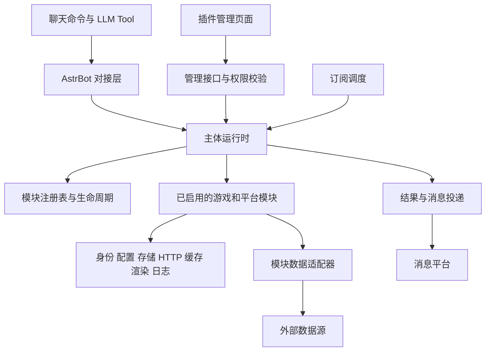

# Yomihime Game Link · 基本设计文档

> 创建日期：2026-09-13。状态：设计草案，未定稿。
> 需求依据：[requirements.md](requirements.md)。本文描述系统结构、模块职责、数据关系与关键交互，不代表功能已经实现。本文不是实现计划，不包含开发步骤、里程碑、排期或提交安排。

## 1. 文档定位与决策规则

需求文档负责产品范围和用户期望；本文负责把需求映射为模块边界、数据模型、交互流程和运行规则。接口字段属于概念设计，具体 Python 类型、数据库表结构和宿主接入方式留待详细设计。

本文使用以下状态：

| 状态 | 含义 |
| --- | --- |
| 需求约束 | 已写入需求文档且没有明显冲突的约束 |
| 已确认决策 | 用户明确确认的设计，相关需求同步更新 |
| 设计建议 | 为形成可讨论方案提出的默认设计，尚未确认为项目约束 |
| 待验证 | 依赖宿主、数据源或授权能力的技术验证 |
| 待确认 | 产品范围或用户行为仍需决定 |

本文不自动覆盖需求文档。两份文档发生冲突时，记录到第 13 节；冻结设计前应同步消除冲突。未经确认，不得把设计建议升级为需求承诺。

当前仓库仅实现 `/ygl` 插件介绍入口。以下目录、服务、页面和数据结构均为目标设计。

## 2. 设计目标与边界

需求约束：

- 主体在零模块或所有模块停用时仍可正常运行。
- 游戏与游戏平台业务通过同一套公开、版本化注册契约接入。
- 主体不硬编码具体游戏名称、配置字段或功能按钮。
- 固定命令与只读 LLM Tool 复用业务服务；事实结果来自数据适配器。
- 已确认决策：`/ygl` 是唯一顶层命令入口，模块功能使用 `/ygl <模块名> <操作> [参数]`，例如 `/ygl dota2 …`。命令以清晰、少量、稳定为目标，不以缩短输入长度为目标。
- 绑定仅保存默认查询对象，不等于验证账号所有权。
- 公开数据与授权数据隔离，个人凭据不进入模型上下文。
- 图片是文本结果的增强，渲染失败不丢失可用的核心查询结果。
- 第三方扩展与主体同进程运行时不构成安全沙箱。

本设计不定义具体外部接口签名，不承诺尚未验证的 Steam 非公开数据读取和 HBR 账号同步，不扩大需求中的可选功能范围。

## 3. 总体结构



### 3.1 职责划分

| 边界 | 职责 | 不承担的职责 |
| --- | --- | --- |
| AstrBot 对接层 | 命令、Tool、消息身份、宿主生命周期适配 | 游戏查询和价格计算 |
| 主体运行时 | 权限检查、模块可用性、任务跟踪、服务装配 | 游戏字段解释和外部响应解析 |
| 注册表 | 描述信息、能力索引、冲突检测、兼容检查 | 执行业务和直接发送消息 |
| 模块业务服务 | 查询、绑定规则、事件生成、结果语义 | 直接修改主体 UI 或其他模块存储 |
| 数据适配器 | 外部请求、字段转换、来源错误映射 | 决定聊天权限或默认绑定 |
| 共用服务 | 受控存储、HTTP、缓存、渲染、日志 | 将所有游戏模型合并为万能对象 |
| 投递服务 | 文本/图片发送、回退、投递状态 | 编造缺失字段或改变统计口径 |
| 管理页面 | 按注册描述展示配置、状态和数据摘要 | 承担个人扫码登录或保存独立配置副本 |

依赖方向为“对接层 → 主体契约 ← 模块”。模块使用主体公开服务接口；模块间复用能力通过声明的服务契约完成，禁止直接导入其他模块内部实现或读取其数据表。

已确认决策：模块把业务数据转换为主体约定的结构化结果；主体统一解释展示协议、渲染和发送。模块适配通用接口，主体不为某个模块新增专属渲染分支，也不执行模块提供的任意页面模板。

### 3.2 建议代码组织

```text
main.py                 AstrBot 插件入口
core/                   注册契约、运行时、身份、结果、权限
services/               配置、存储、HTTP、缓存、渲染、投递、订阅
integrations/astrbot/    命令、Tool、页面与生命周期适配
modules/                内置 game/platform 模块
web/                    通用管理页面和配置组件
docs/                   需求与设计文档
```

这是职责映射，不要求提前创建空目录或空服务。第三方扩展安装在何处由加载机制决定，不要求复制到 `modules/`。

## 4. 模块注册与生命周期

### 4.1 描述与运行实例分离

设计建议：扩展包含可静态读取的清单和启用后创建的运行实例。管理员查看来源、许可证、兼容性和能力声明时，不应为了展示清单而执行扩展业务代码。

| 契约对象 | 主要内容 |
| --- | --- |
| ModuleManifest | 模块 ID、game/platform 分类、版本、契约版本、作者、来源、许可证、资源声明 |
| CapabilityDescriptor | 能力 ID、说明、输入结构、权限、数据敏感级别、所需配置/来源/能力依赖、调用策略（command_only / natural_language_allowed）、输出协议版本 |
| CommandDescriptor | 模块路由名、操作名、参数、能力 ID、权限、帮助文本；均挂载到 `/ygl` 下 |
| ToolDescriptor | 名称、参数、能力 ID、只读标记 |
| ConfigSchema | 字段、默认值、敏感标记、校验和展示描述 |
| DependencyDescriptor | 必需/可选依赖、版本要求、缺失时的降级能力 |
| SubscriptionDescriptor | 事件类型、筛选结构、支持的投递方式 |
| ScheduleDescriptor | 采集器 ID、输入结构、共享范围、规范化键、周期配置、采集入口、事件与匹配入口 |
| ModuleInstance | 启用、停用、健康检查及能力处理入口 |

模块 ID 与持久化命名空间保持稳定。注册应先整体校验，再提交生效；失败时撤回当前模块已创建的资源。主体检测模块路由名及同模块操作名冲突；不同模块可以使用相同操作名。另行检测 `/ygl` 与宿主其他插件顶层命令的冲突，以及 Tool 名称冲突，不能仅检查本插件注册表。

初步确认：账号与周期任务（订阅）相关能力标记为 `command_only`，不注册为 LLM Tool，包括其中的只读状态查看。其他能力可标记为 `natural_language_allowed`，当前只读 Tool 设计继续适用；允许自然语言不代表放开写操作或权限检查。主体生成 Tool 清单和执行调用时均检查调用策略，不能仅依靠提示词约束模型。

### 4.2 状态模型

启用意图、生命周期与健康状态分开保存：

| 维度 | 建议取值 |
| --- | --- |
| 管理员启用意图 | enabled / disabled |
| 生命周期 | discovered / starting / active / stopping / stopped / failed |
| 健康状态 | needs_config / dependency_missing / healthy / degraded / connection_error / module_error |

页面根据三者生成用户可读状态；不能用“开关已打开”表示正常运行。连接异常可以只影响某个能力，历史价不可用不应阻止当前价查询。

已确认决策：能力状态是实际调用判定的基础，模块健康状态由能力状态汇总。每项能力记录 `available / unavailable / unknown`、原因码、受影响依赖和检查时间。配置缺失、来源异常、依赖能力不可用必须能定位到具体能力。

模块已启用时，全部能力可用汇总为正常；一部分可用汇总为部分不可用；全部不可用时展示主要原因与完整原因列表。生命周期状态优先于健康摘要，停用模块不能因旧检查结果仍为 healthy 而执行。

用户未绑定、个人授权失效、当前会话不允许投递属于请求级条件，不写入全局能力健康状态。帮助、页面、Tool 清单读取同一能力状态快照，执行入口仍实时复核。未知状态的只读查询可按受限探测策略尝试，不能展示成已确认正常；写操作和后台任务需先满足声明的前提。

### 4.3 启用与停用

启用顺序：检查契约兼容性和模块级必需依赖 → 执行必要迁移 → 创建模块实例 → 计算能力级配置及依赖状态 → 注册能力和符合条件的受管任务 → 发布状态。模块级缺失阻止启用；能力级缺失只禁用相关能力。必需依赖形成循环时拒绝启用并展示依赖链。

设计建议：停用时先拒绝新调用，撤下可调用 Tool，暂停订阅和排队任务，再取消在途工作。对无法立即取消的工作增加运行代次校验，禁止旧代次结果在停用或重新启用后发送。已经到达外部服务的请求不能承诺撤回。

每项任务都应归属模块实例，受主体跟踪。清理超时不能展示为已正常停用，应显示错误原因；主体仍继续隔离该模块的新调用和结果发送。

停用保留数据；卸载后标记未挂载数据。迁移失败不以空数据覆盖原数据，不继续启用依赖新结构的能力。配置更新是否热生效由字段或模块声明，不支持热更新时执行受控重启。

### 4.4 扩展加载边界

已确认决策：一个扩展包可包含任意数量的模块，不设置业务数量上限；每个模块仍独立注册、启停和展示。资源配额与契约校验不因模块数量不限而取消。

以下为扩展包设计建议：

- 包是安装、版本和代码更新单位，模块是功能、配置、权限和生命周期单位。使用稳定 `package_id` 与 `module_id`，模块全局 ID 为 `package_id/module_id`，面向用户的短路由单独声明并检测冲突。
- 包包含静态 `manifest.json`、模块清单、运行入口、资源清单和依赖声明。静态清单能展示全部模块，不执行模块代码；运行入口只在管理员启用模块后加载。
- 主体管理的扩展发现目录属于运行数据目录，不是内置模块源码目录。目录只读取已安装内容，发现不等于启用；具体安装入口与 AstrBot 的兼容方式仍待验证。
- 不自动执行扩展安装脚本，不在运行期间自动升级共享 Python 依赖。不满足环境依赖时显示准确原因；同进程不可兼容的依赖组合拒绝激活新包版本。
- 包级清单损坏导致整个包不可加载；单个模块声明或注册失败只禁用该模块及其必需依赖方。包的共享导入代码故障可能影响包内多个模块，应报告实际影响范围，不能承诺任意 Python 故障均可隔离。
- 公开契约覆盖注册描述、主体服务、展示协议和调度协议，各自标记版本；模块声明支持范围。新增可选字段应有默认行为，未知必需块或不兼容主版本拒绝注册。依赖引用稳定模块/能力 ID，不引用页面路由或内部 Python 类。
- 包内模块可声明受版本约束的能力依赖，不能通过包内身份绕过主体服务。模块正常运行不依赖加载所有同包模块。
- 代码更新以包为单位，更新前停止其已启用模块和受影响的必需依赖调用，保留启用意图；候选版本验证通过才切换。恢复旧代码必须检查数据结构兼容性，不能在新迁移完成后盲目降级。
- 不承诺任意热替换；涉及共享导入状态或依赖变更时允许要求重载插件或重启宿主。旧代码与备份保留策略属于维护配置，包级更新故障不应修改其他包的数据。

建议包结构如下；这是交付契约示意，不是创建目录的实施步骤：

```text
<package>/
  manifest.json       包信息、契约范围、模块入口、依赖与资源声明
  modules/            各模块实现，可按包自身需要组织
  assets/             声明过来源和许可的静态资源
```

静态清单、受管接口和能力声明用于可审查性及正常扩展的生命周期管理，不构成对恶意同进程 Python 代码的强制隔离。

## 5. 身份、绑定与授权

### 5.1 概念模型

| 对象 | 主要字段或含义 |
| --- | --- |
| Principal | 内部用户 ID、消息身份命名空间、外部用户 ID |
| ConversationRef | 接入实例、私聊/群聊类型、稳定会话标识、投递所需路由信息 |
| Binding | 所属用户、模块、对象类型、稳定对象 ID、默认标记、来源 |
| Grant | 所属用户、模块、授权账号、授权范围、凭据引用、有效状态 |
| LoginSession | 用户、模块、会话 ID、代次、状态、过期时间 |

身份命名空间由消息适配器确定，不能把平台显示名当成唯一隔离依据。只有确认外部用户 ID 在相应范围内稳定且等价时才允许跨接入实例共享身份，不能自动合并不同来源账号。

绑定可以引用公开对象；Grant 必须来自已验证授权链路，不能由 Binding 推导。用户身份取自真实消息事件，不能由 LLM 参数指定或替换。

### 5.2 查询对象解析

设计建议采用以下顺序：显式查询对象 → 当前模块默认绑定 → 模块声明的可选身份派生 → 未绑定提示。对象解析不绕过授权检查；指定其他人的 ID 不能访问其授权缓存。

Dota 2 独立绑定优先于 Steam 派生身份。建议将派生关系保存为来源引用，而不是伪装成用户手工绑定；Steam 换绑、解绑或停用时暂停自动派生并提示，不静默修改 Dota 独立绑定。是否保留既有派生对象供继续查询需在冻结设计前确认。

跨群共享默认绑定、多账号切换与默认账号作用域仍属待确认。数据结构保留多个绑定的表达能力，但不因此默认开放切换功能。

### 5.3 个人数据交付

设计建议：授权个人资料默认私聊交付；群聊触发时引导私聊，不自动将个人结果发回群。主动分享使用独立操作，明确目标会话和字段。私聊不可达时返回操作说明，不改为群发。

登录二维码只经用户专属流程交付，排除在模型上下文和普通日志之外。退出登录应取消该用户登录会话并使本地凭据不可再用于查询；上游支持撤销时尝试撤销，区分本地退出成功与上游撤销结果。

解绑、退出、删除个人数据是不同操作。缓存及生成图片保留期限、退出后是否允许查看旧缓存仍待确认；确认前不得默认无限保存。

## 6. 存储、缓存与数据所有权

需求约束：所有运行数据保存于 AstrBot 插件数据目录，不进入源码仓库。具体根目录由宿主服务解析，不写死开发机路径。

### 6.1 物理组织（设计建议）

采用“一个主体数据库 + 模块受控数据集合 + 独立文件资源”的结构，单个 AstrBot 插件实例使用 SQLite。此处给出推荐选型，不代表已确认支持多进程或多副本部署。模块不自行创建一套账号或订阅数据库，也不取得任意 SQL 执行权限。

```text
<插件数据目录>/
  state.sqlite3          权威状态、关系、事件、缓存索引与结构化记录
  assets/public/         可共享公共素材，内容寻址
  assets/private/        用户隔离的临时私有资源
  renders/               可再生成图片，带访问范围和到期时间
  extensions/            已安装第三方扩展及其版本文件
  backups/               一致性备份，不作为实时数据来源
```

运行配置采用主体数据库作为唯一权威来源的建议方案；AstrBot 配置仅保留必要启动参数，不镜像保存完整模块配置。若宿主必须使用另一配置后端，应整体替换配置服务的存储实现，不维护双写副本。该选择尚需与宿主对接确认。

### 6.2 逻辑结构与所有权

| 数据集合 | 所有权与隔离 |
| --- | --- |
| 模块配置与状态 | 主体按模块命名空间保存，模块仅能取得自身配置；健康检查结果是可重建快照 |
| 用户身份与绑定 | 主体维护身份，模块维护对象语义 |
| 授权信息 | 用户 + 模块 + 授权账号隔离，凭据单独引用 |
| 公开缓存 | 按模块、来源、对象、查询口径共享 |
| 授权缓存 | 在公开缓存维度之外加入用户和授权账号隔离键 |
| 订阅与投递记录 | 独立记录订阅定义、事件、投递尝试和结果 |
| 渲染文件 | 记录来源数据版本、所有者和过期时间 |

建议逻辑表如下，名称和字段表达数据关系，不冻结最终 SQL：

| 表/集合 | 关键字段与关系 |
| --- | --- |
| packages、modules | 包版本、模块全局 ID、契约版本、安装状态、启用意图、配置版本、运行代次 |
| config_entries | scope、module_id、字段键、普通值或 secret_ref、revision；敏感值不直接写普通配置 |
| principals、identities | 内部用户；identity_namespace + external_user_id 唯一映射到内部用户 |
| conversations | 接入实例 + 会话类型 + 外部会话 ID 唯一，保存投递路由与时区 |
| bindings、binding_defaults | 用户、模块、对象类型/ID、来源绑定引用；默认表按用户/模块/作用域唯一引用绑定 |
| grants、secrets | 用户、模块、授权账号、范围、状态、revision、secret_ref；凭据单独加密保存 |
| login_sessions | 用户、模块、代次、状态、到期时间；不保存可复用二维码明文，重启后未完成流程失效 |
| subscriptions | 用户、接收会话、模块、订阅类型、业务条件、投递策略、状态、revision |
| collection_jobs、subscription_sources | 唯一采集键、规范参数、可见范围、下次执行、租约/代次；订阅与采集任务多对多关联 |
| observations、events | 采集键、快照版本、数据引用、完整性、来源时间；事件 ID、业务事件键、状态版本 |
| subscription_evaluations | 订阅及条件版本、已处理观察版本、最近条件状态；保证持续满足条件不反复提醒 |
| deliveries、delivery_attempts | 订阅/事件/接收会话、去重键、内容引用、状态；各次尝试、平台消息 ID、结果 |
| public_cache、private_cache | 公开查询键或用户/授权作用域键、数据版本、采集时间、有效期、访问检查时间 |
| module_records | module_id、collection、owner_scope、record_key、schema_version、结构化 payload、revision |
| assets | 资源 ID、路径、内容摘要、媒体类型、所有者/可见范围、来源许可、到期时间 |
| schema_migrations | 主体或模块命名空间、迁移版本、执行状态和校验信息 |

通用关系和约束由主体管理。模块通过声明的 collection 保存比赛摘要、风格目录等业务记录；主体认识所有权、版本、保留类别和索引声明，不解释 payload 中的游戏字段。集合可声明有限的可索引字段；复杂分析查询若超出契约，应扩展通用存储协议，不能绕过接口直接读其他表。

不持久化无用途的全量上游响应。需要长期价格采样时使用有保留策略的业务集合，不把短期缓存当历史数据库。public_cache 与 private_cache 分表及分接口；private_cache 的 key 包含用户、授权账号及授权版本。

### 6.3 一致性、迁移与删除

设计建议：主体提供受限事务操作。绑定默认值更新、授权版本撤销及关联任务暂停、订阅修订及旧待发记录取消分别作为原子状态变更。事件匹配游标推进与生成待投递记录同事务提交，发送网络请求在事务外执行。

数据库事务不能包住远程请求或图片渲染。文件先写临时位置，再登记资源引用；孤立文件通过清理任务回收。共享公开采集任务不会随单个用户删除而连带删除，只有没有任何有效引用时才停止。

主体维护通用表迁移；模块仅迁移自身集合，迁移失败保留旧版本记录并阻止相关能力使用新结构。跨模块数据不由扩展迁移。建议使用一致性数据库备份并记录匹配的包版本；恢复时先保持后台任务停用，核对授权和投递状态，避免旧备份触发重复推送。

退出立即撤销本地 Grant 的可用性并增加授权版本，取消相关任务及未发送私人结果；再次发送前校验版本，防止旧查询复活。删除个人数据清理绑定、授权、私人缓存、私有资源与个人订阅；群订阅归属及审计保留政策仍待确认，不默认连带删除其他用户共享数据。

凭据建议采用独立密钥的认证加密保存，主密钥从部署环境提供，不与数据库备份一起保存。没有密钥时禁用需保存授权凭据的能力，不能静默退回明文；具体算法与密钥轮换留待详细设计。此举保护落盘数据，不对同进程恶意扩展承诺保密。

### 6.4 缓存与时效

缓存键包含所有会改变结果的参数；FFLogs 包含区域、分区、职业、难度和指标，价格包含商品类型/ID、地区、商店和价格口径。失效授权的缓存不能仅因键命中而被返回。

每份结果区分来源更新时间、采集时间与缓存状态。允许旧缓存时必须标明时间与陈旧状态，过期上限按能力配置。收到上游不可见或授权撤销的明确结果后使相关缓存失效；未重新访问上游时不承诺立即感知公开状态变化。可见性检查周期和最大陈旧上限是能力配置，不以“离线缓存可用”绕过已经获知的权限变化。

## 7. 统一请求、结果与错误

| 模型 | 基本内容 |
| --- | --- |
| RequestContext | 请求 ID、可信调用来源、实际执行者、可选用户/会话、模块代次、授权依据及版本、截止时间、取消信号 |
| QueryInput | 已校验对象与筛选参数，不携带原始凭据 |
| ResultEnvelope | 协议版本、结果 ID、状态、通用展示文档、可选模型事实、来源、时间、敏感级别与警告 |
| ErrorResult | 稳定错误码、可操作说明、是否可重试、受控重试时间 |

### 7.1 可信来源与统一执行边界（已确认决策）

调用来源为 command、llm_tool、scheduler、admin。来源由宿主对接或主体调度器创建，不能接受模型或模块传入的字符串作为授权证明。内部调用继承最初来源，不能借调用其他能力把 llm_tool 提升成 command。

命令操作以真实消息身份为执行者；管理操作以宿主管理员身份为执行者；共享公开采集以受管系统任务为执行者，不伪造聊天用户。订阅匹配和投递再分别带入订阅创建者、订阅 ID/revision、目标会话和所需 Grant/revision，检查订阅及权限仍有效。

`command_only` 约束用户触发的能力入口。模块注册的采集器是独立内部入口，只接受主体调度授权，不调用命令处理器来模拟用户操作。普通查询需要读取默认绑定时通过受控身份解析服务完成，不等于开放“查看绑定”管理能力给 Tool。

执行边界统一检查来源、能力状态、用户权限、授权版本、模块代次和限额。公共采集结果与用户权限解耦；对用户进行匹配、渲染和投递前重新检查对应用户条件。

### 7.2 通用展示协议（已确认方向，字段为设计建议）

模块内部可以保留游戏专属模型；越过主体接口时必须转换为主体定义的 `DisplayDocument`，主体不读取游戏专属字段，也不通过模块类型选择模板。模块返回数据，不返回 HTML、CSS、脚本或可执行渲染回调。

文档包含标题、对象说明、顺序排列的内容块、来源与时间、隐私标签。通用块建议如下：

| 块类型 | 结构与用途 |
| --- | --- |
| text | 段落、说明、警告，文本内容按数据转义 |
| fields / metrics | 标签、类型化值、单位、说明，展示账号摘要或关键指标 |
| table | 列定义、类型化单元格、行与分页提示，展示战绩等列表 |
| item_grid | 稳定条目 ID、标题、图像资源引用、normal/muted 等通用强调状态、角标；可表达 BOX 网格 |
| image | 受控资源引用、替代文本、用途与可见范围；只用于素材，不代替模块应返回的整张结果结构 |
| series | 轴标签、单位和数据点，供通用曲线展示；支持范围由协议版本声明 |
| links / commands | 有标签的链接或规范命令建议，不自动执行 |

数值保留类型、单位和精度；时间携带时区依据，金额携带币种。模块计算成绩、完成率等业务含义，主体负责通用格式化、主题、尺寸、分页、网格排布和平台适配。图片引用经资源服务校验，不能直接读取任意本地路径或抓取任意地址。

所有块必须有可确定生成的文本表示：图像使用替代文本，网格可转为分组列表，曲线提供结构化摘要或数据表。主体在平台限制内分页，不静默截断关键内容。未知可选块有通用文本回退，未知必需块在兼容检查时拒绝；新增展示能力通过通用协议版本演进，而非添加游戏专属块。

例如 HBR 返回标题、持有数/总数 metrics 和携带持有状态的 item_grid，主体不认识“风格”业务也能展示明暗网格。完整布局由主体决定，模块只声明语义顺序与通用分组。

### 7.3 按调用来源选择结果出口（已确认决策）

| 来源 | 输出方式 |
| --- | --- |
| command | 主体按隐私规则发送通用展示文档的文本或图片 |
| llm_tool | 默认返回经协议与权限校验的结构化事实，由模型回答，不再自动发送同一份文字 |
| scheduler | 采集器返回共享观察数据；匹配后生成通用展示文档和持久化投递记录 |
| admin | 返回受控管理响应，交给管理页面展示，不向聊天用户发送 |

Tool 的模型事实使用协议允许的字段、值、单位和来源，不返回模块内部完整对象或凭据。若启用自然语言图片展示，由主体对同一结果 ID 发送一次图片，并向 Tool 返回发送状态和简短事实；已发送、失败和未知状态明确区分，避免再次自动重发。具体宿主是否支持这类图片协作仍需验证。

同一业务结果可以支持多个出口，但出口由主体决定。模块不自行发送聊天消息，也不能自行把账号结果送入模型。隐私标签不得低于能力和输入授权范围要求。

### 7.4 错误与资源限制

建议错误码至少覆盖参数错误、未绑定、需要授权、授权过期、对象不存在、不可公开访问、无记录、未解析、限流、上游异常、模块不可用、能力不支持和无法确认原因。只有来源提供充分证据时才区分“对象不存在”与“不可见”，未知值不转成零。

只读请求可以按来源规则有限重试并遵守限流反馈；登录、授权交换与消息发送不能直接套用查询重试策略。每个请求有总截止时间，模块/来源有并发限制，相同公开查询可合并在途请求。

超时、缓存有效期、图片尺寸/大小和查询条数上限尚未确定。它们必须形成明确配置默认值后才能作为验收基线。

## 8. 核心流程

### 8.1 命令与自然语言查询

#### 命令层级（已确认决策）

统一结构为 `/ygl <模块名> <操作> [参数]`。Dota 2 使用 `dota2`，不另设 `/d2`、`/dota2` 等顶层入口，也不增加 `d2` 等缩写路由。同一功能保留一个规范命令，不为中英文同义词或输入长度维护多套别名。

命令用于明确操作及不依赖 LLM 的查询入口；自然语言查询继续复用同一业务能力。减少命令数量不等于删除无 LLM 时的查询能力：相近查询优先通过同一操作的参数表达，登录、退出、绑定修改等语义不同的操作不为减少数量而混合。

#### 调用范围（初步确认）

- 账号相关功能必须通过命令，包括绑定、查看绑定、换绑、解绑、登录、重新登录、登录状态和退出；授权账号个人数据查询也按账号能力处理。
- 周期任务（订阅）相关功能必须通过命令，包括创建、查看、修改、暂停、恢复和取消。自然语言不能以“只是查看”为由调用这些能力。
- 其他功能允许自然语言调用，同时保留核心查询的命令入口。公开战绩、价格和公共资料查询不会仅因使用默认绑定而变成账号管理，例如“查我的公开战绩”仍可使用自然语言。
- 用户通过自然语言提出账号或订阅请求时，只提供对应命令说明，不执行该操作，也不以自然语言确认替代命令。
- “周期任务必须通过命令”指用户对任务的管理入口；已通过命令创建的任务按订阅规则自动执行，不要求每次触发重新输入命令。管理员的模块停用、受控数据清理仍可影响任务生命周期，但不提供页面创建或修改个人订阅的替代入口。

#### 两级帮助（初步确认）

| 入口 | 展示范围 |
| --- | --- |
| `/ygl help` | 仅展示必须通过命令使用的账号、周期任务操作，以及各模块的 `/ygl <模块名> help` 入口；不展开其他查询命令 |
| `/ygl <模块名> help` | 展示指定模块全部已注册命令，包括必须命令操作和允许自然语言调用的查询命令 |

帮助由同一注册信息生成，根据 `command_only` 策略筛选总帮助。模块帮助显示完整规范路径、参数、用途和必要权限说明；暂不可用的能力标注原因，不能伪装为可执行。未启用扩展不因帮助展示而激活；模块不存在时明确提示不存在。

`help` 是主体保留操作名，模块不得覆盖。无参数 `/ygl` 展示简短插件说明及 `/ygl help` 入口，无参数 `/ygl <模块名>` 提示对应模块帮助入口，不额外形成第三套命令清单。零模块时总帮助展示空状态。

以下业务操作名是设计示例，尚未冻结完整命令表；`/ygl`、`dota2` 模块路由和两级 `help` 结构已确定。

| 示例 | 作用 |
| --- | --- |
| `/ygl` | 插件说明及 `/ygl help` 入口 |
| `/ygl help` | 必须通过命令的操作及各模块帮助入口 |
| `/ygl dota2 help` | Dota 2 全部已注册命令 |
| `/ygl dota2 查询 [对象及条件]` | 玩家或比赛查询，具体参数语法另行设计 |
| `/ygl dota2 绑定 <玩家标识>` | 明确修改默认查询对象 |
| `/ygl steam price <游戏> [地区]` | Steam 价格查询，操作语言尚未统一 |
| `/ygl hbr 登录` | 发起个人登录流程 |

模块路由由模块注册，主体只注册和维护 `/ygl` 根入口及通用分发，不硬编码具体模块。模块停用后其业务路由不可执行，直接输入旧路径时返回不可用说明。无参数只展示帮助，不隐式发起登录、修改绑定或订阅。

其他模块的规范路由名、操作使用中文还是英文、最终操作数量仍待确认。不新增独立的 HBR 中文触发词；目标 Bot 的原命令仅作为行为参考。

#### 请求流转

1. 对接层从真实消息构造身份和会话上下文。
2. 固定命令或 LLM Tool 提供结构化查询参数。
3. 主体检查模块代次、能力状态、权限和请求限额。
4. 模块解析对象；有歧义时返回候选，等待同一用户继续选择。
5. 查询缓存或数据适配器，转换为业务模型。
6. 模块转换为通用结果协议，主体根据调用来源选择命令发送、Tool 返回或后台投递出口。
7. 返回事实或发送前复查调用策略、模块代次与权限；直接发送时记录发送结果。

候选选择需绑定用户、会话、原始查询和有效期，避免不同群或不同用户的数字回复串选。等待提示不是最终结果，不得终止后续处理。图片上传失败时使用文本回退；发送结果未知时避免盲目重复发送。

### 8.2 HBR 登录

设计状态：待扫码 → 待确认 → B 站认证完成 → 游戏授权交换中 → 游戏授权可用。任一步可进入过期、取消或失败。只有游戏授权链路验证成功后才能展示“游戏登录成功”。

重新登录产生新代次，旧二维码和旧回调不得覆盖新会话；退出同时使当前登录流程和后续凭据使用失效。个人资料、BOX、高分分别检查能力可用性，不能因其中一个成功而假定全部接口可用。

账号接口不可用时，公共图鉴或导入 BOX 使用独立能力和来源标记。是否将这些降级能力纳入首个版本仍待确认。

### 8.3 订阅与投递

#### 注册调度与职责（已确认方向）

模块向主体注册采集器和订阅类型，由主体创建、调度、暂停与恢复任务。模块不得为每名订阅用户自行启动轮询循环。不同用户订阅同一公开信息时共享一个逻辑采集任务，每轮只采集一次，再分别匹配条件和投递。

模块负责规范化采集参数、解析来源数据、生成业务事件、判断条件和返回通用展示数据。主体负责唯一任务索引、周期计算、并发和额度、租约、重试、匹配进度及投递。

#### 共享键与数据范围（设计建议）

共享采集键由主体组合模块 ID、采集器 ID/版本、来源 ID、规范化参数和授权范围。参数包含所有影响数据的维度，例如商品类型/ID、地区、商店及查询口径；不能只用游戏名。

阈值、接收会话、用户时区、即时/摘要和静默设置属于订阅，不进入公开采集键。私人采集键必须加入用户和 Grant 版本，即使两个用户绑定同一账号也不自动共享授权数据。

订阅与任务为多对多：一个任务服务多个订阅，一个愿望单订阅可以引用多个公开价格任务。愿望单本身按可见性和授权范围读取，拆出的公开商品价格仍可与其他用户共享；用户关注关系不进入公开事件载荷。

最后一个有效订阅取消或暂停后，按需采集任务停止，已有可用公开缓存可保留。新订阅加入时复用有效快照或在途任务，不强制新增一次请求。交互式查询在相同数据范围和新鲜度条件下也可复用快照或在途采集。

模块可声明按需采集或必要维护任务；后者必须单独向管理员展示，不能借“订阅”隐藏永久轮询。不同采集键可以按来源支持批量请求，但不混合授权范围。一次逻辑采集可能需要分页等多个 HTTP 请求，“只采集一次”不等于承诺严格一个网络请求。

#### 可配置周期（设计建议）

采集周期与通知周期分别配置：前者控制数据新鲜度和上游负载，后者控制即时提醒、摘要时间和静默规则。用户选择每日摘要不会自动把其他订阅共享的数据降为每日采集。

| 配置层 | 配置内容 | 操作方 |
| --- | --- | --- |
| 主体全局 | 默认采集周期、最短允许周期、来源额度、全局并发、退避上限 | 管理员页面 |
| 模块/采集器 | 模块声明默认/下限，管理员覆盖目标周期、超时、并发及失败退避 | 管理员页面，动态配置表单 |
| 单条订阅 | 即时或摘要、摘要时间、时区、静默时段及筛选条件 | 用户命令 |

建议用户不直接控制共享采集周期，避免一个用户把公共任务加速到耗尽额度。具体默认分钟数应按来源验证后设置，不使用一个未经验证的周期覆盖所有数据源。

有效目标间隔取管理员采集器覆盖、模块默认或全局默认，再受模块最短间隔及管理员全局下限约束。来源限流、Retry-After 和退避可以进一步延后；界面分别显示配置周期、实际下次执行时间和延迟原因，不能承诺即时推送等于实时获取。

单个采集键最多一个在途执行，不重叠启动；长任务结束后按间隔安排下一次，不追补每一个错过的时隙。周期修改以新配置版本重新计算下次执行，不取消已发出的外部请求，也不同时生成第二个任务。启动和恢复可加入受控抖动，避免所有采集同时请求上游。

#### 持久化与异常行为（设计建议）

采集器登记后以唯一共享键创建任务；执行领取租约和代次，提交快照时复核所有权。单实例部署是当前建议范围，不把数据库租约视为已经支持跨机器多副本。进程崩溃后重新采集可能重复访问上游，不承诺跨崩溃严格一次执行。

完整快照或标记完整范围的部分结果进入观察记录。失败不能用空结果覆盖上次成功数据，也不能触发“清空愿望单”等业务事件；部分结果只匹配已确认完整的对应对象，其余对象保持原进度。

新订阅建议基于最新有效快照立即判断一次，满足时发送一次初始提醒；持续满足不重复发送。模块声明事件业务键和有意义的变化规则，主体保存每个订阅/条件版本的匹配状态。修改条件增加 revision，取消旧待发内容并重新评估当前快照。

事件匹配完成与投递记录写入同事务提交。相同订阅、条件版本、业务事件版本和接收会话形成唯一投递键；同一会话内相同内容可合并发送，但保留每条订阅的投递关联。摘要只汇总各自有效窗口内未投递事件，不重新采集。

建议投递状态：pending、sending、sent、retry_wait、unknown、failed、cancelled。平台明确接受消息后记录 sent，不代表用户已阅读；响应丢失记 unknown。采集重试与投递重试独立，不因单个会话发送失败重新采集全部数据。

停用模块、取消订阅后取消未发送记录；发送前检查模块代次、订阅 revision 和当前授权。恢复后重新获取当前状态，不批量补发停用期间历史。来源故障按退避处理；会话不可达仅暂停对应投递并展示原因；个人授权失效只暂停相应私人采集与订阅，不影响公开共享任务。

个人订阅由本人管理；群订阅的管理权限、创建者离群后的归属、初始提醒建议及 unknown 投递重试策略仍待确认。周期配置由管理员维护不改变“用户订阅管理必须命令”的规则。

## 9. 各模块设计边界

| 模块 | 内部业务模型 | 数据适配职责 | 未确定或高风险部分 |
| --- | --- | --- | --- |
| FF14 | 角色标识、分区条件、成绩、百分位和指标口径 | FFLogs 战绩与静态资料分离 | 默认区域/分区/职业/指标、指标支持范围和错误可辨识性 |
| Dota 2 | account ID、玩家、近期比赛、单场比赛、解析状态 | 标识解析、玩家资料和比赛数据分离 | 昵称检索覆盖范围、近期条数、模式筛选、主动解析是否开放 |
| Steam | SteamID64、商品引用、报价、历史价摘要 | 身份、目录检索、当前价格、历史价格分离 | 非公开数据授权、地区覆盖、商品包和捆绑包支持范围 |
| HBR | 授权账号、风格目录、持有关系、高分记录 | B 站认证、游戏会话、账号数据、公共目录分离 | 完整授权链路、字段可用性、素材与目录来源 |

### 9.1 价格语义

设计建议：商品引用同时包含类型和 ID，避免仅用 App ID 表达包体或捆绑包。购买地区决定商店报价口径，原生币种与可选换算币种分开；“美元”不能自动映射为唯一国家。

史低比较必须使用相同商品范围、地区、商店和币种。历史最低价与历史最大折扣分别记录，不能假定来自同一次促销。建议将“全网最低”展示为“已覆盖商店最低”，并显示覆盖范围。

是否达到史低按原生货币精度比较；“接近史低”在阈值确认前不作肯定判断。限时领取、免费周末、永久免费的商品状态分别表示。历史数据缺失时返回当前价及缺失原因。

### 9.2 BOX 语义

图鉴目录必须携带服务器/版本、稳定风格 ID 和排序键。完成率的分母限定为所选目录内的风格总数；未收录风格、缺失字段和不完整同步不能直接视为未持有。

跨时间比较只在目录版本相同或完成目录对齐后成立。目录扩充后的排列策略、分页方式及突破信息展示属于待确认的视觉与数据规则。

## 10. 管理页面与宿主接入

页面分为主体设置和模块管理。模块详情从清单、配置结构、能力描述和运行状态生成，不要求模块注入任意页面代码。

管理接口按读取总览、读取模块、更新配置、切换模块、检查连接、读取数据摘要、清理数据划分。本文不冻结 URL 路径；所有接口与受保护资源必须沿用宿主管理端鉴权，前端隐藏按钮不等于权限校验。

设计建议：配置只有一个权威存储来源。页面使用配置版本提交，检测并发修改；敏感字段使用“保持原值、替换、清除”语义，不返回完整值。保存成功、校验成功、启用成功和连接正常分别反馈。

数据清理显示目标模块、数据类型、范围和影响，经过明确确认后执行。错误详情脱敏，不向页面暴露完整请求头、凭据或原始上游响应。

宿主对接涉及 Web API、LLM Tool 注册/注销及插件页面鉴权，具体接口和部署版本兼容性仍须验证。最低 AstrBot 版本、页面资源托管、`/ygl` 根命令参数解析与模块分发、WebUI 不可用时的行为仍须验证；模块增减不要求新增宿主顶层命令。

## 11. 可用性与运行约束

- 缺少某来源凭据只禁用依赖该来源的能力，不将整个模块无条件标记正常或全部关闭。
- 图片渲染、远程素材下载和后台采集应有独立资源上限，避免阻塞消息处理。
- 用户提供的商店链接需按允许的类型和目标解析；不能让通用 HTTP 服务直接访问任意用户输入 URL。
- 日志记录请求 ID、模块、来源、耗时与稳定错误码；不记录完整凭据、二维码和个人响应正文。
- 主体退出时停止调度、拒绝新任务并执行有限时间清理；重启从持久化状态恢复，不依赖仅在内存中的去重记录。
- 获知公开资料转为私密后使相关缓存失效；授权撤销或用户删除数据立即更新本地访问状态。外部可见性尚未重新检查时按声明的检查周期和陈旧上限处理，不承诺即时获知上游变化。
- 所有外部来源、素材和字体分别维护来源与许可信息；本设计不把引用链接视为复用授权。

## 12. 关键场景的行为约束

以下场景用于说明系统边界和异常情况下的预期行为，不构成实施步骤或测试计划：

| 场景 | 期望结果 |
| --- | --- |
| 零模块启动 | 主体可加载，帮助和页面明确显示空状态 |
| 一个模块注册失败 | 其他模块保持可用，失败模块显示原因且无残留能力 |
| 查询过程中停用模块 | 后续新调用被拒绝，旧代次结果不再投递 |
| Steam 换绑且存在 Dota 独立绑定 | 独立绑定不被静默覆盖 |
| 未授权用户指定他人账号 | 不返回对方授权数据或授权缓存 |
| 群聊触发私人 BOX 查询 | 按已确认的隐私规则交付，不隐式公开 |
| 历史价服务失败 | 当前价仍可返回，并说明史低不可用 |
| 图片生成或上传失败 | 可用事实以文本回退 |
| 登录重开后旧流程返回成功 | 旧流程不能覆盖新会话或恢复已退出授权 |
| 投递响应不确定 | 保留 unknown 状态，不冒充已确认送达 |
| 配置并发更新 | 能检测旧版本提交，避免静默覆盖 |
| Tool 间接调用账号能力 | 保留原始 Tool 来源并拒绝，不提升为命令来源 |
| 模块返回新的业务结果 | 适配通用展示块即可呈现，主体不新增该游戏的专属分支 |
| 一名用户登录失效 | 仅该用户授权能力受影响，不改变全局模块健康状态 |
| 多人订阅同一地区同一商品 | 一轮共享一次逻辑采集，各自匹配阈值和通知方式 |
| 采集周期缩短且旧采集仍在执行 | 不重叠启动，下次执行遵循新配置及来源限制 |
| 事件处理时进程退出 | 匹配进度与待发记录保持一致，不丢失已提交事件的投递关系 |
| 一个包包含多个模块 | 各模块独立启停，包级更新明确影响所有同包已启用模块 |

目标负载、请求截止时间、缓存陈旧上限、重试预算和图片限制尚未确定，因此本文暂不承诺具体性能指标。实际部署的 AstrBot 版本和消息平台能力是兼容性边界，本地源码存在相应入口不代表部署环境一定支持。

## 13. 待确认与待验证清单

| ID | 状态 | 问题 | 影响范围 |
| --- | --- | --- | --- |
| D01 | 待确认 | FF14 国服/国际服是否均为必需；需求正文与末尾待确认项需统一 | 支持范围、默认区域 |
| D02 | 待确认 | Steam 首版是否必须提供史低、多游戏比较和愿望单联动 | 能力清单、命令与 Tool |
| D03 | 待验证 | HBR 完整授权链路、凭据生命周期和最小可读字段 | 账号同步能否承诺交付 |
| D04 | 待验证 | Steam 特定非公开数据是否存在本插件可取得的授权路径 | 私人游戏库、愿望单、个性化信息 |
| D05 | 待确认 | 首版必需、可选、待验证能力的统一清单 | 避免可选需求隐式成为首版承诺 |
| D06 | 待确认 | 跨群绑定、多账号、Steam 派生关系随解绑/停用的行为 | 身份与绑定规则 |
| D07 | 待确认 | 私人结果投递位置、主动分享、个人数据进入 LLM 的边界 | 隐私与用户流程 |
| D08 | 待确认 | 群订阅权限、通知默认模式、静默时段、初始提醒、离群与未知投递重试；共享采集和可配置周期方向已确认 | 推送权限和投递一致性 |
| D09 | 待验证 | AstrBot 最低版本、页面入口、统一根命令分发与 Tool 生命周期 | 主体对接与兼容性 |
| D10 | 待确认/验证 | 包内模块数量不限已确认；静态清单、包级更新、版本化协议和依赖冲突拒绝方案见 4.4，实际安装入口待验证 | 扩展交付契约 |
| D11 | 待确认 | 单实例 SQLite、主体统一关系表及模块集合、配置权威来源、密钥部署和备份建议见第 6 节；保留期限待定 | 存储及运行维护 |
| D12 | 待确认 | 地区/币种默认值、史低阈值、商品范围和换算需求 | 价格口径 |
| D13 | 待确认 | FFLogs 默认统计口径、Dota 近期范围、BOX 目录及排序 | 业务模型与展示 |
| D14 | 待验证 | 数据源地区覆盖、访问条件、额度、字段及素材许可 | 各模块可用能力 |
| D15 | 待确认 | 性能、超时、并发、渲染和容量默认值 | 非功能需求与完成标准 |
| D16 | 待确认 | 除 dota2 外的规范模块路由、业务操作语言及最小命令表；统一入口、账号/订阅必须命令及两级 help 展示规则已初步确认 | 命令交互一致性 |
| D17 | 待确认/验证 | 主体通用展示方向已确认；通用块字段、协议版本及 Tool 图片发送的宿主适配需细化 | 统一展示及结果出口 |

上述问题在对应章节维护最终结论。确认时更新相关正文并关闭条目，避免把互相冲突的方案长期并列为有效设计。

## 14. 参考依据

- [需求文档](requirements.md)：产品范围和约束。
- [项目说明](../README.md)、[开发指南](../CONTRIBUTING.md)、[当前入口](../main.py)：功能状态与验证方式。
- [Steam 身份认证](https://partner.steamgames.com/doc/features/auth)：OpenID 身份验证与 SteamID。
- [Steam OAuth](https://partner.steamgames.com/doc/webapi_overview/oauth)：Client ID 和授权接入条件。
- [IsThereAnyDeal API](https://docs.isthereanydeal.com/)：地区、商店历史低价与价格历史接口口径。

外部资料作为需求与设计参考，不表示所有模块接口均完成验证。接口接入前应再次确认实际使用能力和访问条件。
