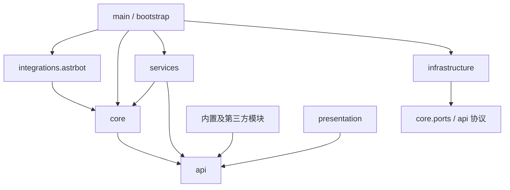
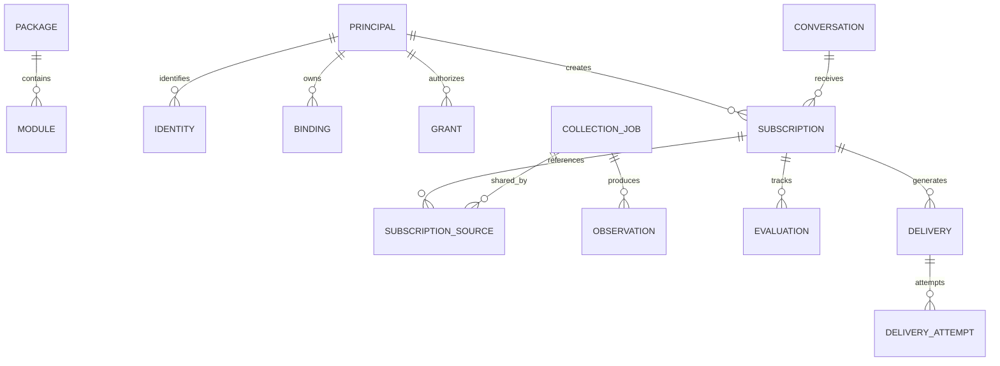
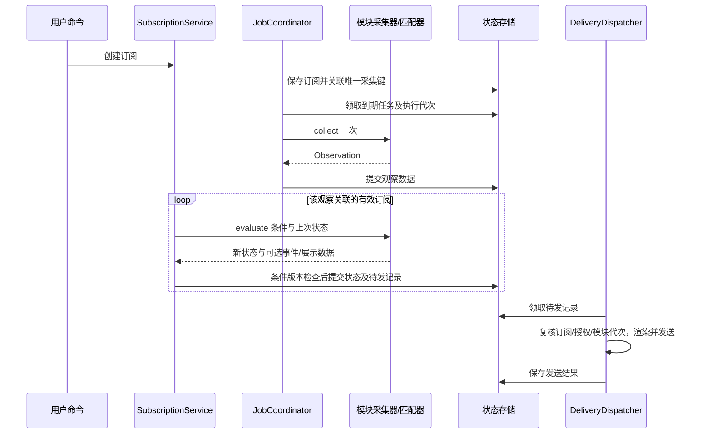

# Yomihime Game Link · 主体代码架构设计

> 创建日期：2026-09-13。状态：代码架构草案。
> 依据：[需求文档](../requirements.md)与[基本设计](../basic-design.md)。本文描述目标代码组织、接口、依赖和运行机制，不是实现计划，不包含开发步骤、里程碑、排期或提交安排。

> AI 协作入口：[统筹协议](orchestration.md)、[工作包目录](work-packages.md)、[任务卡模板](task-template.md)。实现者只执行已填写任务卡中的范围；本文全篇不是一次性开发任务。

## 1. 文档边界

本文负责主体代码与公共契约，是各模块对接的唯一技术契约来源。分工和模块入口见[架构索引](../code-architecture.md)。主体开发归属 `main.py`、`bootstrap.py`、`api/`、`core/`、`services/`、`presentation/`、`infrastructure/`、`integrations/` 和 `web/`；游戏专属行为由各模块文档定义。

当前仓库只有 `main.py` 中的 `/ygl` 介绍入口；本文中的目录、类型、数据库表和服务均为目标设计，不表示已经存在。Python 代码片段为接口示意，省略部分类型定义，不应作为可运行实现直接复制。

需求文档定义功能范围，基本设计定义系统行为，本文定义代码职责及协作契约。已确认的约束不因本文件细化而改变；数据库、依赖库、宿主接入及默认数值未最终确认的部分继续保留为设计建议。

设计基准为单个 AstrBot 插件实例、单进程受管任务和 SQLite 存储。多副本分布式调度不在当前承诺范围内。本文不依赖未核实的具体 AstrBot 方法签名，不选择 HTTP、图片渲染或加密库。

## 2. 架构不变量

1. 唯一顶层命令为 `/ygl`；模块只注册根入口下的路由。
2. `/ygl help` 只列必须通过命令使用的能力和模块帮助入口；`/ygl <模块> help` 列该模块全部命令。
3. 账号和订阅管理必须使用命令；其他允许自然语言的只读能力可以注册 Tool。调用来源不可由模型或模块提升。
4. 模块返回主体定义的结构化展示协议；主体负责所有最终展示和发送。
5. 主体、渲染器和页面不包含游戏名称判断及游戏字段解析。
6. 能力可用状态是路由、Tool、帮助和页面状态的共同依据，个人授权状态不污染全局健康状态。
7. 模块只使用公开服务接口，不读取主体内部数据表，也不直接调用其他模块实现。
8. 订阅由主体调度；同一公开信息的同一轮采集共享，匹配与投递按订阅分别处理。
9. 模块停用使新调用和旧代次结果失效；重新启用不复活旧任务。
10. 一个扩展包可包含任意数量的模块。包管理代码版本，模块管理能力与启用状态。

## 3. 目标代码布局

目录按变化原因组织。下列文件是职责落点，允许在规模较小时合并紧密相关文件，不要求为目录树创建空壳类。

```text
main.py
bootstrap.py
api/                            模块可使用的版本化公共契约
  __init__.py                   受控导出面，不导出内部实现
  manifests.py                  包、模块、能力与配置声明
  contexts.py                   上下文只读视图
  results.py                    统一结果、错误、模型事实
  display.py                    通用展示块与类型化值
  subscriptions.py              采集、观察、匹配及订阅协议
  storage.py                    集合及受限存储接口
  services.py                   模块可见的服务协议
core/                           主体运行控制，不依赖 AstrBot 类型
  registry.py                   已校验注册快照、路由与能力索引
  invocation.py                 能力调用及结果校验
  policy.py                     来源、权限、授权与结果出口规则
  lifecycle.py                  模块状态、代次、依赖和启停
  health.py                     能力状态及模块汇总
  task_scope.py                 任务所有权、取消和资源限额
  help_catalog.py               同源帮助视图
  extensions.py                 静态发现、兼容检查与包加载控制
  ports.py                      主体需要的宿主/存储/执行器接口
services/
  identity.py                   消息身份映射和对象解析
  bindings.py                   绑定与默认关系
  authorization.py              Grant、登录会话与凭据版本
  configuration.py              配置校验、版本与敏感字段更新
  records.py                    模块集合、命名空间与所有权
  cache.py                      公开/私人缓存边界
  resources.py                  素材引用、文件生命周期及范围校验
  dependency_calls.py           声明过的跨模块能力访问
  scheduling/
    catalog.py                  ScheduleDescriptor 索引
    jobs.py                     共享键、任务和订阅来源关联
    coordinator.py              到期任务调度、代次和并发
    collector.py                受管采集调用及观察发布
    evaluation.py               按订阅匹配、状态和事件提交
    timing.py                   周期、退避、摘要时间计算
  delivery/
    outbox.py                   待发记录、领取、重试与回执
    dispatcher.py               校验、渲染及消息端口调用
    summaries.py                摘要聚合与订阅关联
presentation/                   主体通用展示，不允许模块专属分支
  validation.py                 文档版本、块类型、大小与资源检查
  text.py                       全部块的文本表示
  layout.py                     平台尺寸、主题、分页与布局
  image.py                      通用块图片展示
  model_facts.py                允许返回模型的事实投影
infrastructure/                 具体 IO 实现
  sqlite/
    database.py                 连接和事务边界
    repositories.py             主体关系表访问，可按领域拆文件
    migrations/                主体结构迁移
  http.py                       异步网络、来源额度与受控目标
  secret_store.py               加密凭据及密钥来源
  files.py                      数据路径、资源文件和清理
  render_backend.py             可替换的图片执行后端
integrations/astrbot/
  plugin_host.py                生命周期与宿主装配
  command_bridge.py             /ygl 解析和上下文创建
  tool_bridge.py                Tool 发布、调用及返回
  message_port.py               私聊/群聊、平台发送结果转换
  admin_bridge.py               宿主鉴权及管理接口
  identity_adapter.py           平台身份作用域转换
modules/                        内置模块实现，分别见模块文档
web/                            通用管理页面，不包含模块业务页面
  module-list.*
  module-detail.*
  config-form.*
  status-view.*
docs/
  requirements.md
  basic-design.md
  code-architecture.md          总索引与并行开发边界
  code-architecture/            主体与各模块设计
```

`modules/*/display.py` 仅构造展示数据，不绘图、不提供模板、不控制 CSS。`web/*` 的扩展名和前端工具尚未选择。运行数据目录结构见基本设计第 6 节，不与上述源码目录混放。

## 4. 依赖方向与装配



图中箭头表示代码依赖，不表示运行数据方向。主体调用模块依赖的是 `api` 中的协议，具体实例由装配层传入。

| 代码区域 | 可依赖 | 禁止直接依赖 |
| --- | --- | --- |
| api | 标准类型和协议定义 | core、services、AstrBot、数据库、具体模块 |
| core | api、内部端口 | 具体游戏、AstrBot 事件类型、SQLite 实现 |
| services | api、core 端口及明确注入的协作接口 | 具体游戏实现、其他服务的私有字段 |
| presentation | api 展示模型、注入资源/渲染端口 | 模块模型、上游响应、业务数据库 |
| integrations | core 入口、api、宿主 API | 具体游戏和直接 SQL |
| modules | api 和自身代码 | core/services/infrastructure 内部实现、其他模块内部代码 |
| infrastructure | 它实现的协议、具体 IO 库 | 游戏业务决策 |

`bootstrap.py` 是组合入口：选择后端、构造依赖并组装根对象，返回 `PluginRuntime` 给宿主入口。`PluginRuntime` 只暴露启动、关闭、调用和状态查询等入口，不同时实现数据库、渲染和业务服务。

服务间依赖通过构造参数显式声明。模块取得的是按模块、权限和任务作用域绑定的 `ModuleServices`，不是可按字符串取得任何对象的全局容器。

## 5. 公共模块契约

### 5.1 静态声明与运行绑定

静态清单包含可在不执行代码时展示的描述：包 ID、模块 ID、路由、能力、命令、配置、订阅、调度、版本及资源要求。运行工厂只绑定声明过的处理器，不得在启用时偷偷增加未声明能力。

为支持模块独立维护，包清单可引用包内各模块的局部 `manifest.json`，由静态加载器校验路径、读取并合并。包总清单由集成维护者维护，模块开发维护各自局部清单；引用必须位于包根目录内，局部清单不独立安装。合并后仍统一检查模块 ID、路由、能力及协议冲突，不能借局部清单绕过包级校验。

```python
class ModuleFactory(Protocol):
    async def create(self, services: ModuleServices) -> ModuleInstance: ...

class ModuleInstance(Protocol):
    def handlers(self) -> ModuleHandlers: ...
    async def start(self) -> None: ...
    async def stop(self) -> None: ...
    async def check_health(self) -> HealthReport: ...

class CapabilityHandler(Protocol):
    async def invoke(
        self, context: InvocationView, parameters: ValidatedInput
    ) -> CapabilityResult: ...
```

`ModuleHandlers` 按静态 ID 绑定能力处理器、采集器和订阅匹配器。启用校验确保没有缺失处理器、额外 ID 或重复绑定。`start()` 不创建脱离主体跟踪的永久循环。

### 5.2 描述模型

| 描述 | 主要字段 |
| --- | --- |
| PackageManifest | package_id、package_version、协议范围、modules、环境依赖、作者/来源/许可 |
| ModuleManifest | module_id、route、category、factory_entry、能力及资源声明 |
| CapabilityDescriptor | id、input_schema、invocation_policy、effect、required_config/sources/capabilities、output_version、privacy_floor |
| CommandDescriptor | operation_path、capability_id、参数映射、帮助文案 |
| ToolDescriptor | name、capability_id、结构化参数映射、说明 |
| CollectionDescriptor | name、schema_version、所有权类型、保留类别、允许索引字段 |
| ScheduleDescriptor | collector_id、key_version、输入结构、共享范围、周期配置、数据版本、触发类型 |
| SubscriptionDescriptor | type_id、筛选结构、关联采集器、匹配器、通知方式 |

能力定义权限与输入结构，命令和 Tool 只定义入口映射，不能通过重复声明放宽权限。`effect` 区分只读和状态修改；`invocation_policy` 区分必须命令与允许自然语言，两者不可互相替代。

注册表是校验后的不可变快照。更新时整体替换快照并增加 revision，帮助、页面和 Tool 使用同一 revision，执行时再检查当前状态。`help` 为保留路由，不允许模块覆盖。

### 5.3 模块可见服务

| 接口 | 可执行操作 | 约束 |
| --- | --- | --- |
| ConfigView | 读取自身配置及版本 | 不读取其他模块配置，不提供全局配置写入 |
| IdentityResolver | 解析当前用户默认对象 | 只返回本次能力所需身份，不枚举他人绑定 |
| AccountOperations | 绑定、解绑、授权与登录状态操作 | 必须持有主体颁发的命令作用域 |
| SubscriptionOperations | 创建、修改、查看及取消当前授权范围订阅 | 命令来源和会话权限双重检查 |
| ModuleRecords | 在声明的集合中读写、查询与条件更新 | 命名空间、所有者、schema 和限额校验 |
| CacheAccess | 公共或当前授权范围缓存 | 不接收任意用户 ID 作为访问授权 |
| SourceHttp | 访问声明的数据源、有限重试与超时 | 凭据绑定、目标限制、并发与额度由主体控制 |
| ResourceAccess | 登记声明素材及读取资源引用 | 不读取任意路径，不直接发送素材 |
| DependencyInvoker | 调用声明过的其他模块能力 | 继承原始来源、截止时间和隐私范围 |
| TaskScope | 创建有限时、受跟踪的模块工作 | 继承代次、取消信号和限额 |

模块没有 `send_message`、任意 `execute_sql` 或任意切换调用来源的接口。声明式服务边界约束可信扩展的正确使用，不是对恶意同进程代码的安全沙箱。

## 6. 调用上下文与权限

### 6.1 内部上下文与只读视图

内部 `InvocationContext` 由 `ContextIssuer` 创建，包含 invocation_id、origin、actor、conversation、module_epoch、registry_revision、grant/subscription_revision、deadline 和 cancellation。

模块只取得 `InvocationView`。实际授权通过主体保存的作用域句柄关联；不能通过自行构造相同字段获得访问。CLI/命令文本中出现“command”不构成可信来源。

| origin | 实际执行者及依据 |
| --- | --- |
| command | 宿主消息事件映射的 Principal、会话及权限 |
| llm_tool | 宿主 Tool 调用绑定的真实用户与会话，不接受模型提供 actor_id |
| scheduler | 主体签发的采集任务作用域；私人采集额外绑定有效 Grant |
| admin | 宿主管理端已验证的管理员作用域 |

公开共享采集不伪造用户。订阅评估和投递使用对应订阅所有者及版本，重新检查它的访问范围。后台采集器不是账号命令的替代入口。

### 6.2 能力调用

`InvocationGateway` 负责定位能力、输入校验、Policy 检查、任务归属、超时与结果协议校验。具体业务在模块内执行。

```text
来源桥接 → ContextIssuer → InvocationGateway
                           ├─ Registry + Health + Policy
                           ├─ 模块 CapabilityHandler
                           └─ ResultValidator → OutputRouter
```

`DependencyInvoker` 保留原始 origin 并收紧作用域，不允许提升权限。内部跨能力调用只返回数据，不再次触发最终输出；只有最外层调用交给 `OutputRouter`，避免组合查询重复发消息。调用链保留父请求 ID，并限制递归深度和循环依赖。

模块可能返回成功、部分成功、待选择或稳定错误。候选选择保存用户、会话、原始来源、候选 ID 和有效期；再次选择保留权限约束，不能把一次 Tool 查询转成账号命令。账号修改的选择确认也必须使用规范命令。

## 7. 能力状态与模块生命周期

`HealthIndex` 按 capability_id 记录 available/unavailable/unknown、原因、依赖和检查时间。`LifecycleController` 管理 enabled 意图、生命周期及单调增加的 epoch，两者不合并为一个布尔值。

`AvailabilityResolver` 使用全局能力状态和请求级条件产生本次可调用结论。未登录属于用户条件；来源服务不可达属于全局能力状态。模块摘要从能力状态聚合，不反向覆盖能力状态。

运行记录建议结构：

```text
ModuleRuntimeState
  module_id / enabled_intent / lifecycle / epoch
  instance_ref / task_scope / active_registry_revision
  capability_health / last_failure
```

启用涉及兼容检查、模块级依赖、迁移、实例创建、能力状态检查和原子发布。能力级配置缺失仅禁用该能力。失败清理已创建的作用域和注册项，保留可审查的失败状态。

停用先关闭调用准入并使 epoch 失效，再撤下 Tool、暂停采集及待发记录，取消受管工作，最后释放实例。旧工作即使未能立即取消，也不能提交新的用户结果。

发送许可的最终检查与停用准入使用同一模块门控。已经提交到平台的网络发送不可撤回，因此“停用后不发送”指停用生效后不批准新的发送；此前在途发送应等待结束或标为未知，不承诺撤回已经被平台接收的消息。

`TaskScope` 跟踪协程、IO 与渲染执行。图片等阻塞工作交由受限执行端口，不阻塞宿主消息循环；不能因为取消异步等待就假定后端工作已经停止，仍需结果代次校验。

## 8. 结构化展示与结果出口

### 8.1 公共结果

```text
CapabilityResult
  schema_version / result_id / status
  document: DisplayDocument
  model_facts: FactDocument | absent
  provenance[] / timestamps / privacy / warnings[]
```

模块自己的 Player、Match、Price、Style 等模型不直接传给主体。模块的展示映射函数将其转换成上述公共类型；原始响应只在适配器内部使用。

`DisplayDocument` 由 title、subject、ordered_blocks、sources、timestamps 和 privacy 组成。block 为带类型标识的联合结构，支持 text、fields、metrics、table、item_grid、image、series、links、commands。

| 类型化值 | 必需语义 |
| --- | --- |
| 数字/比例 | 精度、单位；缺失单独表达，不能自动置零 |
| 金额 | 精确数值和币种，不由渲染器推测汇率或地区 |
| 时间 | UTC 时刻或明确的日期/时区语义，不混用 |
| 图片资源 | 受控 asset_id、替代文本和可见范围 |
| 命令建议 | 规范命令路径与参数，仅展示不执行 |

价格、完成率、胜负和业务警告由模块计算。主体只做格式化和布局，不根据标签文字猜测游戏含义。

### 8.2 渲染职责

`DocumentValidator` 校验块类型、版本、嵌套与内容大小、类型化值和资源范围。`TextPresenter` 为所有块生成文本；`LayoutEngine` 决定主题、尺寸、分页；`ImagePresenter` 交给通用渲染后端。

主体不接收模块 HTML/CSS、绘图函数或整张业务卡片来绕过协议。普通素材图可引用，图片类型不能成为任意自定义结果渲染通道。

示例：BOX 是 metrics 加 item_grid，持有状态映射为 normal/muted；对局是 fields 加 table；价格是 metrics 加可选 series。无需在主体新增 HBR、Dota 2 或 Steam 专属类型。

未知可选块须提供协议内的 fallback_text，主体跳过未知结构并展示该文本。未知必需块拒绝兼容；若运行时违反声明则返回可操作错误，不直接回显整个对象。资源或图片失败只影响相应增强展示，核心文字仍可用。

### 8.3 出口与去重

| 出口 | 责任 |
| --- | --- |
| CommandOutput | 隐私检查后生成文本/图片，调用消息端口 |
| ToolOutput | 返回允许的 FactDocument；默认不重复发送文本消息 |
| SubscriptionOutput | 生成持久化待发记录，延迟交给 Dispatcher |
| AdminOutput | 返回受控管理 DTO，不发送聊天消息 |

自然语言图片为可选宿主适配：主体按 result_id 与目标会话记录发送状态，Tool 得到 delivered/failed/unknown 回执及简短事实。不能只写“已发送”而不记录平台结果，也不在 unknown 状态盲目重发。

FactDocument 只含可进入模型的事实与来源；`privacy_floor`、Grant 和文档资源范围共同限制输出。派生图片的可见范围不能比源数据更宽。群触发私人结果如何交付遵循基本设计，不因出口复用而扩大公开范围。

## 9. 存储访问架构

### 9.1 主体仓储与模块集合

SQLite 实现位于 `infrastructure/sqlite`；业务服务依赖仓储协议。`api` 不暴露数据库连接、表名和事务连接对象。

| 主体仓储 | 数据所有权 |
| --- | --- |
| ModuleRepository / ConfigRepository | 包、模块、启用意图及配置版本 |
| IdentityRepository / BindingRepository | 用户身份、会话、绑定和默认关系 |
| GrantRepository / LoginRepository | 授权状态、版本、登录代次与凭据引用 |
| SubscriptionRepository / JobRepository | 订阅、共享采集任务及多对多关系 |
| ObservationRepository / EvaluationRepository | 快照、事件、匹配游标及条件状态 |
| DeliveryRepository | 待发记录、尝试、回执及摘要关联 |
| RecordRepository / CacheRepository / AssetRepository | 模块集合、分区缓存和资源元信息 |

模块集合接口示意：

```python
class RecordCollection(Protocol):
    async def get(self, key: str) -> VersionedRecord | None: ...
    async def put(
        self, key: str, value: RecordPayload, expected_revision: int | None
    ) -> VersionedRecord: ...
    async def query(self, query: DeclaredIndexQuery) -> RecordPage: ...
    async def delete(self, key: str, expected_revision: int) -> None: ...
```

Collection 在颁发时已绑定模块、声明集合和所有权范围；调用者不能通过 `query` 更改用户范围或注入字段表达式。查询只使用已声明字段、操作符和分页上限。首次创建与覆盖的语义应明确区分，不能用省略 revision 静默覆盖已有记录。

### 9.2 核心关系



图仅展示主要关系，完整集合见基本设计第 6 节。索引与约束至少包括身份复合唯一键、模块路由唯一键、采集键唯一、订阅来源关联唯一、投递幂等键唯一，以及所有用户数据的所有权外键。

`binding_defaults` 用独立关系维护每作用域的默认项，避免多个绑定同时标记默认；模块 ID、主体用户 ID 和对象 ID 分别表示，不以显示名关联。

### 9.3 事务与并发

主体内部 `UnitOfWork` 管理多仓储事务，模块只调用语义操作，例如 `replace_default_binding`、`revoke_grant`、`revise_subscription`，不自行拼接跨表事务。

| 原子操作 | 必须共同提交的内容 |
| --- | --- |
| 默认绑定修改 | 新绑定/默认关系及派生关系状态 |
| 本地授权撤销 | Grant revision、相关私人任务暂停及待发记录取消 |
| 订阅修订 | 条件 revision、采集来源关联变化、旧待发记录取消 |
| 订阅匹配提交 | 条件状态、处理游标、事件关联和待发记录 |
| 投递领取/完成 | 尝试记录、状态、平台消息引用 |

网络调用、模块匹配函数和渲染不在数据库事务中执行。匹配先基于输入版本计算，再以版本条件事务提交；期间订阅变化则丢弃旧计算并重新评估。事务提交后的任务唤醒只是优化，周期扫描可从数据库恢复待处理工作。

文件使用临时文件、受控重命名和元信息登记，孤立资源可清理。数据库备份需保持一致性并记录包版本；恢复后调度保持暂停，避免重放旧投递。私人数据删除不连带删除共享公开任务。

### 9.4 凭据、迁移与保留

`SecretStore` 加密保存凭据，配置和 Grant 只持 secret_ref。主密钥独立提供，不写入同一备份；无有效密钥时不降级明文。日志对象序列化不得展开 secret 内容。

主体表由主体迁移；模块迁移只获得自身集合视图。建议以新集合版本写入、验证、切换活动版本实现可恢复迁移；未成功切换时保留旧版本。模块迁移代码不持有通用表事务权限。

缓存、观察记录、历史样本、去重记录和图片分别声明保留类别。清理不能删除仍被待投递记录引用的数据，也不能早于配置的重试窗口清空去重依据。具体保留期限仍需按来源与部署容量确定。

## 10. 共享采集与订阅代码架构

### 10.1 采集与匹配协议

```python
class Collector(Protocol):
    def normalize(self, parameters: CollectionInput) -> NormalizedInput: ...
    async def collect(
        self, context: CollectionView, parameters: NormalizedInput,
        previous: ObservationView | None,
    ) -> Observation: ...

class SubscriptionEvaluator(Protocol):
    def evaluate(
        self, subscription: SubscriptionView, observation: ObservationView,
        previous_state: EvaluationState | None,
    ) -> EvaluationDecision: ...
```

`normalize` 和 `evaluate` 不访问网络。`EvaluationDecision` 包含新条件状态、业务事件键/版本、是否触发及通用展示数据，不直接改数据库或发消息。需要额外数据时声明采集依赖，由主体准备观察数据，不在每个用户匹配时重复访问来源。

`Observation` 包含数据协议版本、来源时间、采集时间、完整范围及模块私有的结构化数据。主体存储元信息并把载荷交还该模块匹配器，不解释游戏字段。给用户输出的必须仍是 DisplayDocument，不能直接发送 Observation。

### 10.2 共享键

```text
CollectionKey = canonical(
  module_id, collector_id, key_version,
  source_id, normalized_parameters, visibility_scope
)
```

主体规范序列化、计算摘要并保存规范原值；模块提供经过 schema 校验的标准参数。默认值、大小写、排序无关集合和数值格式应归一化，不能把相同查询拆成多个任务。

公开范围不包含订阅者、阈值和通知设置。私人范围包含 Principal、Grant 及 revision，不因账号 ID 相同跨用户合并。来源访问上下文若影响数据，也必须进入键或触发缓存/任务失效。

愿望单采集与商品价格采集分开：私人愿望单产生一组公开商品引用，经主体修订订阅来源关联；公开价格可复用其他用户的任务。某个用户移除愿望单商品只移除自己的关联。

公开共享以同一模块采集器为边界；不同模块读取相同上游不会仅凭 URL 自动合并。需要跨模块复用时声明依赖同一个公共采集能力，避免在主体建立游戏专属去重规则。

### 10.3 时序



调度只负责采集频率；匹配读取共享快照；投递有独立队列和重试。某一群不可达不能迫使所有用户重新采集。

### 10.4 周期配置与任务执行

```text
requested_interval = 管理员采集器覆盖 ?? 模块默认 ?? 主体默认
target_interval = max(requested_interval, 模块下限, 主体下限)
next_due = 不早于完成时间 + target_interval、来源限制和失败退避
```

首次采集可立即安排，随后不重叠执行；建议失败使用有上限的退避并加受控抖动。所有数值均须经过单位、上下限校验，具体默认值尚未冻结。

配置版本变化重新计算 next_due，不重启尚未结束的采集。周期缩短且已经到期时只安排一次，不补跑错过的每个时隙。租约续期与结果提交校验 execution_token，失去租约或模块代次变化的结果不得覆盖新执行结果。

除全局并发外，分别限制模块、来源和同一采集键的并发。模块可声明来源支持的批量采集，批处理保留每个对象的完整性和失败状态。一个逻辑采集允许多页 HTTP 请求，不承诺一个请求即可完成。

新订阅复用满足新鲜度要求的观察或在途工作。交互查询需要更鲜数据时提出刷新请求，由同一 JobCoordinator 合并并受限执行，不绕开来源额度另发请求。

用户通过命令管理通知模式、摘要时间及条件；管理员通过通用配置页面管理采集周期。时区影响摘要窗口和显示，不进入与时区无关的公开价格键。摘要窗口采用带时区的日历规则，数据库保存确定的 UTC 边界及窗口 ID，避免时间重复时重复投递。

### 10.5 事件与投递一致性

未完整采集不能视为“没有数据”。上游失败保留旧快照；部分成功只推进已完成对象的观察和匹配状态。

事件键由模块定义业务轮次，主体把订阅 ID、revision、事件键/版本和接收会话组合成投递幂等键。持续满足阈值依靠持久化 EvaluationState 去重，不能只按每次采集时间判断新事件。

摘要使用已匹配事件，不额外采集。合并相同会话消息时保存每条订阅的关联，发送前重新检查仍有效的成员；一个订阅取消不应取消其他订阅有效内容，失效内容不能留在已生成合并文档中。

`DeliveryDispatcher` 区分 pending、sending、sent、retry_wait、unknown、failed、cancelled。宿主返回“请求已提交”不等于用户阅读；进程恢复时旧 sending 转为待核对的 unknown，而非直接重发。未知结果的重试政策仍待确定。

## 11. 扩展包加载与版本

### 11.1 包与模块

一个包的模块数量不限；不要求全部同时加载。全局 ID 由 package_id/module_id 构成，用户路由独立声明。包的共享函数不能隐式启动其他模块或读取其状态。

清单建议字段：

```text
package_id / package_version / author / source / license
contracts: registration, services, display, scheduling
environment_dependencies[]
modules[]: module_id, route, category, factory_entry, descriptors
assets[]: relative_path, media_type, source, license
```

资源路径限制在包根目录内，安装时拒绝路径越界。静态清单只包含数据；类型/字段限制、数量和体积预算用于防止加载耗尽资源，不代表限制包的业务模块数量。

### 11.2 公开 API 装载

建议由主体发布一个唯一版本的契约命名空间，并由扩展加载器绑定；扩展不复制主体内部类，也不硬编码 AstrBot 的临时插件加载路径。具体可导入名称须随宿主安装方式验证后冻结，本文中的 `api/` 是源码落点，不承诺第三方能直接 `import api`。

装载器在执行 factory 前提供已校验的 API 版本和 ModuleServices。相同协议模型在主体和扩展间必须使用同一实现或经明确序列化边界转换，避免两份类导致类型身份不一致。

### 11.3 故障与更新

清单损坏按包报错，单模块处理器故障按模块报错，必需依赖方降级或停用。包共享导入失败可以影响包内多个模块，不能强行称为单模块隔离。

更新单位为包，保留各模块启用意图。候选包需校验清单、协议、环境依赖和数据兼容性后激活；导入缓存无法可靠释放或依赖变化时要求宿主重载，不承诺任意热替换。

新包迁移成功后的旧代码回退必须验证数据版本或恢复一致性备份。卸载只卸载代码，数据标为未挂载；清除数据使用独立管理操作。不自动运行安装脚本或升级共享依赖。

## 12. AstrBot 入口与管理页面

`main.py` 保留宿主插件声明和最小生命周期委托。模块名称、命令详情和配置字段全部来自注册快照。

`CommandBridge` 解析 `/ygl` 下模块、操作和参数。模块/操作识别使用确定规则，不交给 LLM；多词名称、引号和候选确认使用统一参数语法，最终语法另行确定。解析失败返回该模块帮助入口。

`ToolBridge` 只发布策略允许且状态满足的 Tool，实际调用仍走 Gateway。Tool 被撤下后，对旧会话残留调用返回不可用错误，不假定删除列表即可撤销所有在途调用。

`HelpCatalog` 对总帮助按 command_only 筛选，对模块帮助列全部命令并附状态和必要权限说明；二者不维护单独手写列表。无模块时返回空状态。

`AdminBridge` 在宿主鉴权后访问管理服务，输出配置结构、能力状态及计数 DTO。页面只展示 DTO，不判断游戏字段。配置更新使用 expected_revision 和敏感字段 keep/replace/clear，不回显原密钥。

采集周期通过 ScheduleDescriptor 自动生成管理字段，显示配置值、受限后的目标周期、下次执行和延迟原因。个人订阅管理不增加网页旁路。

宿主隔离端口建议包含 MessagePort、HostIdentityPort、AdminAuthPort 和 ToolCatalogPort。具体 AstrBot API、前端资源托管及最低版本仍需验证，业务代码不依赖这些签名。

## 13. 代码级边界检查依据

本节定义架构应保持的性质，不是测试实施计划：

- 新模块接入不改主体路由分支、渲染器或页面业务条件。
- 模块导入仅触达公共 API；公开 API 不导入数据库或宿主对象。
- command_only 能力不能通过 Tool、内部跨模块调用或伪造参数执行。
- 根调用产生一次最终输出，嵌套能力不自行发送。
- 展示数据不包含任意模板，未知块按版本契约处理。
- 模块关闭、授权撤销、订阅修订和投递竞态有对应版本或代次校验。
- 同一公开采集键不会按用户数量创建重复在途任务。
- 条件匹配没有网络请求，游标与待发记录共同提交。
- 私人缓存、素材和派生结果不能因共享键或内容相同跨用户可见。
- 集合迁移不修改通用表，包更新不假定数据可以任意降级。

## 14. 尚未冻结的接口细节

| 项目 | 当前边界 |
| --- | --- |
| 公开 API 导入名称、扩展安装入口 | 由主体提供唯一契约版本，实际宿主装载方式待验证 |
| 序列化与 schema 库 | 保持显式版本和类型化协议，不指定依赖库 |
| SQLite 后端与配置权威来源 | 沿用基本设计建议，宿主启动配置与运行配置不双写 |
| 渲染后端与页面技术 | 只能实现通用协议，不接受模块自定义渲染代码 |
| 调度默认周期、额度、超时和保留期 | 均可配置，需来源及部署容量依据后定值 |
| 账号查询范围、群权限与绑定作用域 | 继承基本设计待确认项，不在接口中隐式扩大权限 |
| unknown 投递重试与初始提醒 | 保留显式状态，未决定前不承诺严格一次送达 |
| Steam/HBR 授权与来源可用性 | 仍需独立验证，不因接口存在就声明业务可用 |

本文件中的命名和接口细节可以随设计讨论调整，但不得破坏第 2 节的不变量。后续设计变化应同时核对基本设计对应章节，避免把不同规则分别保留为有效版本。
